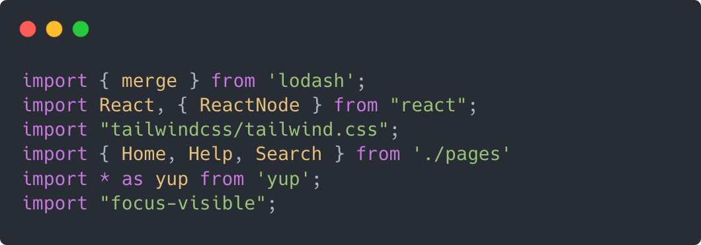
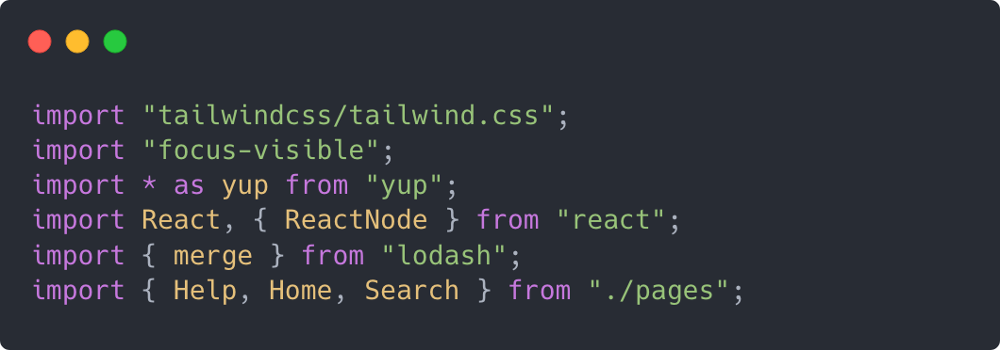

# Prettier Plugin Tidy Imports

A prettier plugin that, sorts, combines, and removes unsused imports from your Javascript/Typescript project.

## Example

### Before



### After



## Sorting

Imports are sorted into 4 distinct groups `Side Efffect`, `Namespace`, `Third Party`, and `Relative`. Every group is then sorted alphabetically except `Side Effect` imports where their ordering matters. Inside `Third Party` and `Relative` groups, `default` imports are placed at the top, and named imports (imports inside `{}`) are also ordered.

### Definitions

- Side Effect - `tailwindcss/tailwind.css`
- Namespace - `import * as yup from "yup"`
- Third Party - `import { merge } from "lodash"`
- Relative - `import Utils, { map, filter } from './utils`

### Typescript Path Aliases

This package doesn't know the difference between `Third Party` imports, and aliases defined in the `tsconfig.json` [paths](https://www.typescriptlang.org/docs/handbook/module-resolution.html#path-mapping) config. If you want to make sure these are grouped separately, you should prefix your aliases with a symbol not used in third party modules such as the tilde (`~`).

## Installation

```sh
npm install --save-dev @mattinton/prettier-plugin-tidy-imports
```

```sh
yarn add -D @mattinton/prettier-plugin-tidy-imports
```

**NOTE**: This package requires `prettier` and `typescript` to be installed as peer dependencies.

## Usage Warning

This plugin breaks Prettier's rule of only printing code as plugin actually transforms your imports. If this concerns you please don't use this package.
